# ServerSideRadProject18
**Server Side Rapid Application Development (RAD) Shipping System Project 2018.** 

# Description
Write a Spring Boot MVC application that allows a user to manage Ships, Shipping Companies and Orders.

# Requirements
The application written in Spring Boot and based on skeleton application available on Moodle, should use Spring MVC n-tier architecture – Controllers, Services, Repositories, Views, with the appropriate data/logic in each tier.

**Model for the application consists of three objects:**

  •	**Ship**
  
    o	Ship ID
    
    o	Name
    
    o	Number of Passengers
    
    o	Cost
    
    o	Size (metres)
    
    o	Associated Shipping Company
  
  •	**Shipping Company**
  
    o	Shipping Company ID
     
    o	Name
    
    o	Home Port
    
    o	Company Balance
    
    o	Associated Ships
    
    o	Associated Orders
  
  •	**OrderInfo**
  
    o	Order ID
    
    o	Associated Shipping Company
    
    o	Associated Ship
    
    o	Order Date
    
These models are given in the skeleton code for the project and their dependencies already set up.

# Submission
Zipped file containing source code of entire application should be uploaded to Moodle.

# Skeleton
The application should be created by updating the skeleton application available on Moodle.

# Functionality
- Main Screen
When the application starts, the user should see the following screen:
 
**Figure 1 Main Screen**
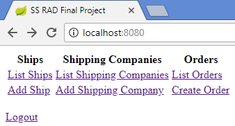

- List Ships
This screen shows the list of Ships in the shipping database:
 
 
**Figure 2 List Ships**
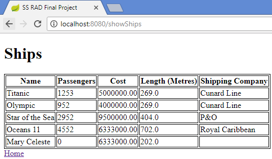
 
-	Add Ship

This screen allows the user to add a new Ship. 

-	Success Conditions

If all information is entered correctly, the shipping database is updated with the new Ship information:

**Figure 3 Add Ship – OK**
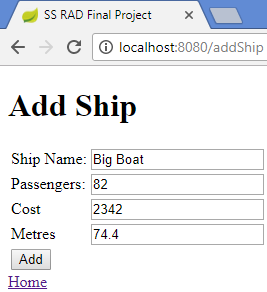
And the user is immediately brought to the List Ships page, where the Ship just entered is shown:

**Figure 4 List of Ships after Ship added**
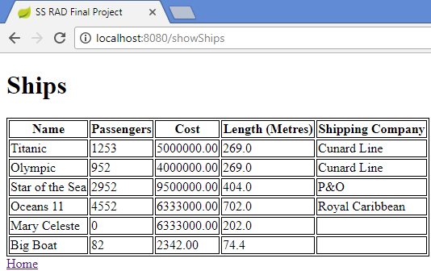

- Invalid user input conditions

If any of the following errors exist:

•	The Ship name is blank

•	The number of passengers is less than 0

•	The cost is less than 1

•	The cost is blank

•	The size is less than 1

Appropriate error messages should be shown, and no Ship should be added to the shipping database.
 

**Figure 5 Add Ship – NOK**
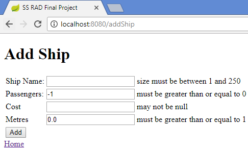

-	List Shipping Companies

This screen shows the list of Shipping Companies in the shipping database.

The Ships column lists the ship(s) associated with each Shipping Company.
 
 
**Figure 6 List of Shipping Companies**

-	Add Shipping Company
This screen allows the user to add a Shipping Company. 
6.5.1	Success Conditions
If all information is entered correctly, the shipping database is updated with the new Shipping Company:
 
 
**Figure 7 Add Shipping Company – OK**
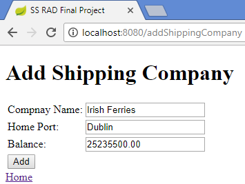

And the user is immediately brought to the List Shipping Companies page, where the Shipping Company just entered is shown:

**Figure 8 List of Shipping Companies after new Shipping Company added**
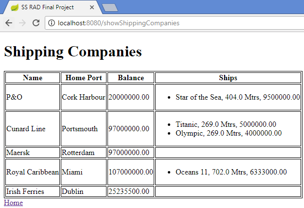

-	Invalid user input conditions

If any of the following errors exist:

•	The Shipping Company name is blank

•	The Home Port is blank

•	The cost is less than 1

•	The cost is blank

Appropriate error messages should be shown, and no Shipping Company should be added to the shipping database.
 

**Figure 9 Add Shipping Company – NOK**
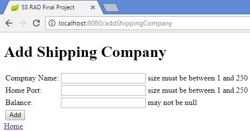

-	List Orders
This screen shows the list of Orders in the shipping database, indicating the Shipping Company name and Ship name.

**Figure 10 List of Orders**
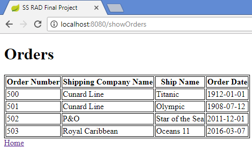

-	Create Order

This screen allows the user to create an Order.

It contains two fields:

•	Ship Name – This is a drop-down list of all ships that are not currently associated with any Shipping Company. Also displayed is the cost of the ship.

•	Shipping Company – This is a drop-down list of all Shipping companies. Also displayed is the Shipping company balance.
 
 
**Figure 11 New Order**

-	Success Conditions

If both a Ship and a Shipping Company are successfully selected, an order may be placed, and if the order is valid, the user is immediately brought to the List Orders page, where the new Order is shown:
 
 
**Figure 13 List of Orders after new order added**
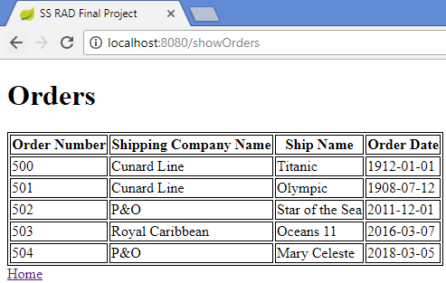

-	Business Logic for Order Creation:

•	The Cost of a Ship should not be greater than the balance of the Shipping Company attempting to order a Ship, if so an error page should be shown:
 
 
**Figure 14 Attempting to order a Ship when Cost > Shipping Company Balance**

 
**Figure 15 Error after attempting to order a Ship when Cost > Shipping Company Balance**
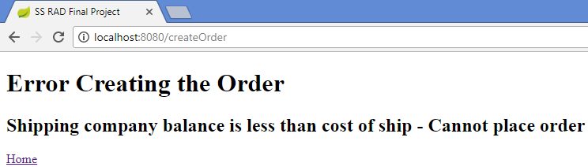

•	If the cost of a Ship is not greater than the Shipping Company balance a new order should be created specifying the Ship ID and the Shipping Company ID.

Also, the Order date (the current date) should be automatically inserted by the application.

After successful order creation, the user is returned to the List Orders page.

**Figure 16 Ordering a Ship where Cost <= Shipping Company Balance**

 
**Figure 17 List of Orders with newly created Order**
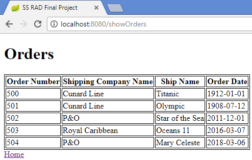

•	As part of creating a new order, the Ship table should be updated to reflect the fact that the Ship being ordered in now associated with the Shipping Company.
 

**Figure 18 Ship associated with Shipping Company**
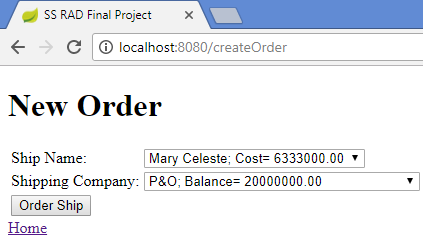

•	Also, as part of creating a new order, the Shipping Company table should be updated to reflect the new balance (previous balance – cost of Ship).
 
**Figure 19 Shipping Company with new Balance**
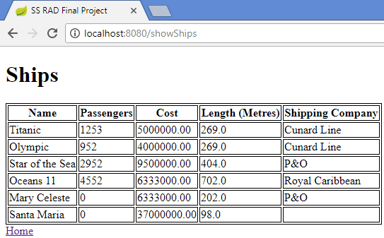

-	Invalid user input conditions
If no Ship and/or Shipping Company is/are selected, an error page should be displayed informing the user of this.
 
 
**Figure 20 Attempting to create an order without selecting a Ship**
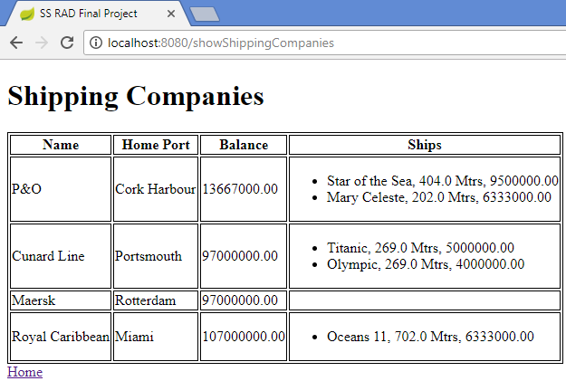
 
**Figure 21 Attempting to create an order without selecting a Ship - Error Page**
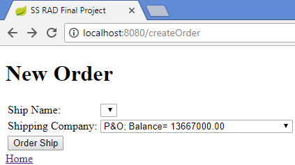

-	Security

The application should implement security on the following pages:

•	Add Ship

•	Add Shipping Company

•	Create Order

Only logged in users should be able to access these pages.

There should be one user (user) with password user.

6.8.1	Logout
There should be a logout option on the Main Screen.
 
**Figure 22 Logout option on Main Screen**
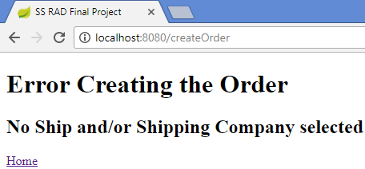
